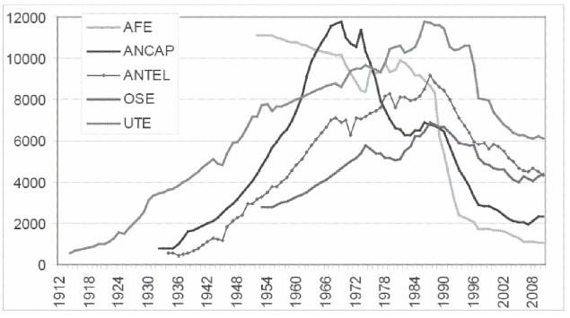

# Empresas públicas: el caso uruguayo ^[Basado en el marco del acuerdo de cooperación entre la Facultad de Ciencias Sociales de la UdelaR y la Unidad Reguladora de los Servicios de Energía y Agua (URSEA) y contó con financiamiento de la Corporación Andina de Fomento (CAF).] {#eepp-uy}

Rosario Domingo
Leandro Zipitría


\

Como se discutió en el capítulo \@ref(#reg-eepp), la existencia de empresas públicas es un fenómeno habitual y económicamente significativo, pudiendo encontrarse empresas públicas en diversos sectores relevantes de la actividad económica en la mayoría de los países. En el caso de la economía uruguaya, en particular, las empresas públicas también son actores relevantes. Los servicios que prestan estas empresas alcanzan al 12% de la canasta del Índice de Precios al Consumo (IPC),
^[Se consideraron los rubros agua, saneamiento, electricidad, gas por red, supergas, nafta, gas oil, telefonía fija y celular.]
los gastos en que incurren representan un 10% del Producto Bruto Interno (PBI),
^[@WorldBank2014]
y algunas de ellas representan una fuente de ingresos para el gobierno central.
^[@WorldBank1995 e información del MEF tomada del siguiente [sitio](http://www.mef.gub.uy/indicadores.php).]

La literatura económica, por su parte, aborda extensamente la temática de las empresas públicas, principalmente, en países en vías de desarrollo.
^[En el capítulo \@ref(#reg-eepp) se desarrolla esta temática. Una bibliografía de referencia es @Jones1982, @WorldBank1995, y para un análisis de las empresas en los países socialistas, @Roland2000.]
En este marco, este trabajo analiza la existencia de empresas públicas en América Latina, el proceso de creación y la situación actual de las empresas públicas en Uruguay, así como de las unidades reguladoras correspondientes. La primera sección presenta brevemente la evolución de las empresas públicas en la región. La segunda presenta la génesis y creación de las empresas públicas en Uruguay. En la tercera se analiza la situación de los principales mercados en que operan las empresas públicas uruguayas, mientras que en la cuarta y en la quinta se consideran los mecanismos de regulación establecidos para estas empresas en América Latina y en Uruguay, respectivamente. Finalmente, se caracterizar el marco jurídico institucional en el que operan empresas y reguladores en Uruguay.


## Empresas Públicas en América Latina

Desde fines del siglo XIX se pueden encontrar en muchos países latinoamericanos, empresas de propiedad estatal actuando en sectores claves de la economía. A fines de ese siglo y comienzos del siglo XX, estos países se encontraban en una fase primaria de su desarrollo económico. Los problemas técnicos que enfrentaba el Estado para poder regular los sectores de infraestructura de transporte y comunicación, necesarios para el desarrollo de la actividad exportadora, y las fallas en los mercados de capitales fomentó el surgimiento de empresas estatales en estos mercados. En general, la presencia del Estado en estas actividades respondía a la sensibilidad política de las mismas (suministro de agua potable, transporte, etc.) al hacerse cargo de servicios que dejaban de atender las empresas extranjeras.

A partir de los años treinta del siglo pasado y como consecuencia de la crisis mundial que generó dificultades para adquirir productos manufacturados, los países de la región se plantean el desarrollo de una industria liviana orientada al mercado interno. Este proceso fue promovido por nuevos actores políticos, económicos y sociales que demandaban un papel más activo del Estado en las áreas que se consideran estratégicas para el crecimiento económico. En las décadas del 30 y del 40 puede observarse una creciente participación del Estado en los sectores de energía e infraestructura. 

En este período se producen, también, una serie de nacionalizaciones de empresas extranjeras que operaban en algunos servicios públicos y en sectores extractivos, donde se concentraban las riquezas básicas de muchas de estas economías. Estas nacionalizaciones se debieron tanto a motivos políticos, como al cese de las concesiones otorgadas a las empresas extranjeras y a la necesidad de rescatar aquellas empresas que presentaban muy baja rentabilidad.

A mediados del siglo XX, como consecuencia del agotamiento del modelo exportador primario y de las propuestas de desarrollo surgidas desde la CEPAL, la mayoría de los países de la región iniciaron un proceso de sustitución de importaciones que implicó desarrollar una industria pesada, para lo cual fue necesario el apoyo de los estados nacionales. Este apoyo no sólo incluyó el diseño de diversas políticas económicas -inversión pública, cambiaria, arancelaria, fiscal, etc.- sino que también implicó que el Estado actuara como empresario, con el objetivo de suministrar bienes y servicios necesarios para el proceso de industrialización. 

En el período 1950-1970, las empresas de propiedad estatal se multiplicaron y se expandieron a diversos sectores: producción de insumos, infraestructura industrial y servicios públicos que utilizaba el sector industrial privado -generalmente a tarifas y precios subsidiados-, así como producción de bienes de consumo final. En este proceso, como el desarrollo de los grandes proyectos industriales implicaban recursos que el capital privado nacional no disponía, la opción del Estado empresario fue, en muchos casos, preferida a la inversión extranjera. Por tanto la participación del sector público en la actividad económica creció sustancialmente.

Si bien el origen de las empresas públicas en América Latina es heterogéneo, según @Morales1990, los principales motivos para su creación fueron:
- suministrar servicios públicos tradicionales (electricidad, agua, transporte);
- sustituir viejos monopolios coloniales en manos de empresas extranjeras, a través de la nacionalización de estas empresas;
- cubrir la falta de inversión privada, sobre todo en sectores de baja rentabilidad o de alto riesgo;
- apoyar la ejecución de políticas o planes económicos mediante la realización de actividades estratégicas o inexistentes pero necesarias para el desarrollo económico del país;
- comprar empresas privadas en quiebra con el objetivo de mantener el empleo y la producción;
- evitar la penetración extranjera en actividades tecnológicas de punta; y
- cubrir necesidades sociales.

En los setenta, como consecuencia de la crisis internacional y el agotamiento del modelo de sustitución de importaciones como motor del crecimiento, en muchos países de la región las empresas públicas fueron el principal inversor mediante la obtención de créditos internacionales. Esto implicó una expansión de la participación de las empresas de propiedad estatal en la generación del producto y un incremento del endeudamiento externo de los países. La excepción fue Chile, donde entre 1974 y 1978 se produjeron las primeras privatizaciones de empresas públicas (se vendieron 550 empresas) aunque se excluyeron aquellas vinculadas a los servicios públicos [@Estache2004].

La crisis de la deuda determinó que en muchos países latinoamericanos se replanteara el papel del Estado como empresario. Influyeron, además, las recomendaciones que los organismos internacionales de crédito realizaron con el objetivo de que estos países pudieran superar los acuciantes problemas económicos que enfrentaban (inflación, alto endeudamiento externo, crisis de balanza de pagos, falta de inversión, etc.)

En los ochenta, evaluaciones realizadas sobre el desempeño del Estado empresario en América Latina señalan una serie de problemas. Entre ellos cabe mencionar: (i) la falta de claridad y jerarquización de los objetivos de las empresas; (ii) deficiencia en la gestión empresarial y falta de un cuerpo profesional de administradores; (iii) menosprecio de la eficiencia y la racionalidad económica; y (iv) excesiva politización del manejo de estas empresas (@Morales1990 a partir de las conclusiones del seminario regional sobre reestructura económica en América Latina organizado por CLAD-ILPES-INAP en 1988).

Esta situación la ilustra citando la definición de una empresa hipotética realizada por @Kelly1985: “Se crea una empresa pública grande, dotada de recursos que superan con creces los de la gran mayoría de las principales empresas del país. Su presidente necesariamente debe ser amigo del partido de gobierno y es de libre remoción. Podrá nombrar gerentes que a él mejor le parezca, pero los salarios que les ofrece alcanzan menos de la mitad de lo que ganan sus colegas en la empresa privada. La gerencia no puede fijar los precios de venta unilateralmente; no puede despedir a los trabajadores fácilmente; no puede cambiar ciertos proveedores; tiene que dar créditos que nunca se cobran a ciertos clientes (…)”.

Es así que a fines de los ochenta y fundamentalmente en los noventa se produce, en la mayoría de los países de la región, un proceso de privatización de empresas públicas con diferente grado de profundización según los países. En 1996, Argentina, Bolivia y Perú habían privatizado más de la mitad de los activos de las empresas propiedad del Estado, México cerca de un cuarto, Brasil un 12%, y Chile y Venezuela un 7% [@Ramamurti1999]. @Estache2004 señalan que este proceso implicó que 1.500 empresas públicas fueran privatizadas o cerradas, generando un flujo de recursos importante para los gobiernos. 

Las privatizaciones no tuvieron las mismas características e impacto en los diferentes países y sectores. Por otra parte, no lograron la profundidad y celeridad que algunos organismos internacionales, como el Banco Mundial, proponían en sus recomendaciones de política a la salida de la crisis de la deuda. El propio Banco Mundial señala que si bien las privatizaciones son buenas del punto de vista económico, en raras ocasiones también son buenas desde una óptica política [@WorldBank1995].


## Empresas Públicas en Uruguay

Los estudios económicos sobre empresas públicas son escasos en Uruguay. En general, se centran en el análisis de temas específicos como demanda, precios, tarifas, eficiencia o productividad. Asimismo, la temática de las empresas públicas también se aborda en el marco de estudios sobre cambios institucionales, proceso de diseño e implementación de políticas y reforma del Estado.

Por otra parte, en el marco de la discusión sobre la privatización de las empresas del Estado desarrollada a comienzos de los 90, se encuentran algunos estudios con un perfil de historia económica y social que buscaron analizar la génesis de estas empresas y el papel de las mismas en la historia económica y social del Uruguay moderno.

Tanto @Nahum1993 como @Solari1983 datan en las últimas dos décadas del siglo XIX la génesis de las empresas públicas en Uruguay. En este período opera un incremento de la acción del Estado en la economía como parte de un proceso de modernización y consolidación de lo que @Nahum1993 denomina “la élite profesional del gobierno”. Es en esos años que se aprueban leyes sobre los ferrocarriles (1884 y 1887), el Estado construye el puerto de Montevideo (1901) y administra, en forma provisoria, los servicios de energía eléctrica (1987-1906).

A partir de comienzos del siglo XX, en el período denominado “primer batllismo”, se incrementa sustancialmente la acción del Estado en la esfera económica-productiva del país. Según @Nahum1993, este proceso se da bajo el influjo de una élite de políticos profesionales que “veían en el poder público su instrumento y su medio de vida”, y por la falta de un empresariado nacional con iniciativa y capital para desarrollar alguno de los emprendimientos necesarios para la modernización del país. En este período, se estatizan los bancos (Banco de la República Oriental del Uruguay-BROU y Banco Hipotecario del Uruguay-BHU), se nacionalizan los seguros, se establece el monopolio de la producción de energía eléctrica y de los servicios portuarios, y se aprueban una serie de leyes sociales que caracterizan el desarrollo del Uruguay moderno.

@Nahum1993 señala diversas razones que fueron fundamentales para que en el primer batllismo se concentrara la creación de empresas públicas o la estatización de empresas que, hasta esa fecha, eran propiedad tanto de capitales extranjeros como de capitales nacionales. Entre ellas pueden sintetizarse las siguientes:

1. **Económicas**: bajar el precio de los servicios; mejorar la calidad los servicios; contribuir a las necesidades fiscales y sociales del Estado (bajar impuestos y sustituir impuestos indirectos a los efectos que la carga fiscal no lleve a una mayor desigualdad en la distribución de la riqueza); impedir el drenaje de oro al exterior, a través de las ganancias que remitían las empresas extranjeras; y consolidar la “soberanía nacional” y el “desarrollo”.

1. **Sociales**: solidaridad, como fin de las acciones del Estado; extensión de los servicios; y proporcionar servicios de interés general.

1. **Políticas**: el Estado como representante de los intereses superiores de la sociedad, por encima de las clases sociales, y como impulsor del progreso mediante el crecimiento sostenido de la economía, lo que le otorgaba derecho para “invadir” el campo de la actividad económica privada dado que el “interés general” es superior al particular de las empresas; defensa de la soberanía económica, fundamentalmente a través del rechazo al poderío que ejercían las empresas, principalmente las extranjeras; y defensa del Estado como buen administrador aduciendo que se podían formar organismos públicos completamente independientes de la política y sin los defectos de la burocracia.

De la revisión de los motivos que llevaron a la creación de las empresas públicas en Uruguay, se puede observar la conjunción de los siguientes fenómenos: (i) problemas de fallas de mercado que impidieron el desarrollo de los servicios, como ser mercados de capitales poco desarrollados para movilizar los recursos o empresarios adversos al riesgo para llevarlos a cabo; (ii) una importante debilidad institucional del Estado para poder controlar la forma en la que las empresas privadas desarrollaban sus funciones, que lo obligó a asumir un rol productivo;
^[Ello forma parte de la falta de compromisos privados que señala @Perotti2004 y que refiere a las limitaciones que enfrentan los Estados para poder controlar y regular en forma efectiva decisiones de los agentes privados.]
(iii) este último problema llevó no sólo a la creación de empresas públicas, sino también a otorgarles el monopolio para el desarrollo de las actividades y, en algunos casos, como en la telefonía, el rol regulador del propio sector.

El marco en el cual las empresas públicas uruguayas operaron, hasta hace un par de décadas, era reflejo de las debilidades técnicas, institucionales y políticas que enfrentaba el Estado para poder regular en forma efectiva a estos sectores. Muchos de los diversos controles que deben enfrentar las empresas públicas están diseñados en la Constitución de la República, sin considerar las capacidades de los diversos organismos técnicos para realizar un control adecuado de las mismas.

Según @Nahum1993 las empresas públicas fueron creadas, en su mayoría, para atender finalidades sociales, sobre todo a través de la consecución de objetivos económicos específicos. Al inicio de su actividad ampliaron y abarataron los servicios de interés general; contribuyeron a Rentas Generales permitiendo suplir la recaudación de algunos impuestos; redujeron el déficit externo al disminuir las transferencias al exterior por ganancias o beneficios; contribuyeron a afirmar el papel asistencial del Estado; y dieron espacio y poder al Estado para incidir con fuerza en la vida económica.

Sin embargo, a partir de 1930 se produce un proceso de reducción de la eficiencia y de la buena administración de alguna de estas empresas, fundamentalmente por el incremento del número de funcionarios contratados. Esta situación se agrava a partir de la década del 50, debido al estancamiento económico que sufrió Uruguay y que llevó a que el Estado absorbiera mano de obra que no necesitaba, a los efectos de evitar las altas tasas de desempleo. Lo anterior, unido al clientelismo político, puso a la gestión de las empresas del Estado al servicio exclusivo del sistema político lo que provocó, entre otros males, un deterioro del resultado de estas empresas llegando a cuestionarse su viabilidad económica. @Solari1983 señalan que a partir de la segunda posguerra se observa un proceso en el cual se hizo uso del aparato estatal para lograr mecanismos de redistribución del ingreso, como instrumento para asegurar la subsistencia del sistema político.

Este cambio es consistente con el gradual proceso de mutación de los objetivos de las empresas públicas. Al ser empresas controladas por el sistema político, siguen los avatares de la economía política. A principios del siglo XX la economía uruguaya era sólida respecto a la economía internacional, lo que se mantuvo hasta el final de la década del 30. Ello permitió que el Estado aumentara su papel en la economía. 

A partir de la década del 50, en el marco de una economía estancada, las empresas públicas pasan a ser un instrumento más de la política económica, es decir, cambia la ponderación relativa de sus diversos objetivos. @Rama1990 señala un crecimiento importante en el número de funcionarios de la administración pública en general, y de los entes públicos en particular, entre los años 1951 y 1957, como consecuencia de un shock positivo -pero transitorio- que enfrenta el país. Las cifras que presentan @Bertino2012 y que se reproducen en el siguiente gráfico, son elocuentes respecto al incremento sistemático en el número de trabajadores de las empresas públicas, hasta la década de los setenta.




Fuente: @Bertino2012, gráfico 4.


En los 90, predominaban en la región y en el resto del mundo las propuestas de reformas orientadas al mercado, con el objetivo de promover la eficiencia económica y el crecimiento. @Forteza2003 mencionan las políticas desarrolladas en esos años, con el objetivo de promover la competencia, la apertura comercial, la privatización y el desmantelamiento de los monopolios de las empresas públicas. Estas medidas se planteaban bajo el supuesto que las mismas permitirían generar mayores niveles de competencia, promover la inversión privada y el progreso técnico y, en consecuencia, una asignación de recursos más eficiente. 

Asimismo, sostienen que los cambios tecnológicos, observados hacia fines del siglo pasado, habían modificado la vieja concepción de que los servicios públicos constituían monopolios naturales y, por tanto, surgían propuestas de incentivar la competencia en dichos mercados con el objetivo de reducir los costos para el consumidor final y, fundamentalmente, para las empresas, lo que mejoraría la competitividad de la economía.

Bajo estos supuestos, en la mayoría de los países de la región se produjeron procesos o intentos de privatización de empresas estatales que operaban en diferentes mercados, entre ellas las empresas de servicios públicos. Según @Bergara2005 los intentos de privatización en la región tuvieron resultados parciales, observándose una mayor aceptación en aquellos países donde la provisión estatal de servicios públicos era sumamente deficiente.

Si bien en Uruguay las empresas públicas tenían algunas características que las diferenciaban de lo que sucedía en otros países de la región (no tenían grandes déficits y realizaban una cobertura del servicio bastante amplia) las mismas presentaban deficiencias en lo relativo a la calidad del servicio que prestaban [@Forteza2003]. 

En este marco el gobierno de la época intenta aplicar reformas orientadas al mercado, principalmente, en los sectores de energía eléctrica, comunicaciones y combustibles. La finalidad de las reformas era incrementar la competencia en los mercados de los servicios públicos y privatizar, parcialmente, a las empresas públicas. Para ello se propusieron leyes que modificaban el alcance de los monopolios de las empresas públicas y posibilitaban la incorporación de capitales privados [@Bergara2005].

La [Ley No. 16.211](http://www.parlamento.gub.uy/leyes/ley16211.htm) de Empresas Públicas, aprobada por el Parlamento en 1992, establecía el cierre de algunas empresas públicas (ILPE - pesca), la privatización de otras (PLUNA - aviación) y la venta parcial de la Administración Nacional de Telecomunicaciones (ANTEL), y representó el primer intento por realizar reformas orientadas al mercado. Este intento fracasa ante el referéndum que provocó la derogación de algunos artículos de esta ley (principalmente los referidos a ANTEL). Ello llevó a profundizar la política de mejora y búsqueda de eficiencia de las empresas públicas, en el marco de cierto consenso sobre la utilización de los beneficios de estas empresas como fuente adicional de ingresos fiscales [@Bergara2005].

@Forteza2003, a su vez, señalan que una vez cerrada la posibilidad de las privatizaciones, la agenda de la reforma de los servicios públicos se reorientó hacia la remoción de los monopolios a través de la desregulación, la competencia y la asociación con privados en nuevos emprendimientos. La [Ley No. 16.832](https://www.impo.com.uy/bases/leyes/16832-1997) de Marco Regulatorio del Sector Eléctrico (1997) reiteraba la posibilidad de competencia en la generación de energía tal como lo establecía la Ley Nacional de Electricidad del año 1977 ([Decreto Ley No. 14.694](https://www.impo.com.uy/bases/decretos-ley/14694-1977)), mientras mantiene a la Administración Nacional de Usinas y Transmisiones Eléctricas (UTE) como empresa monopólica estatal en la transmisión y distribución de la energía eléctrica. 

Con la regulación de esta ley se establece, en el año 2000, la Unidad Reguladora de la Energía Eléctrica (UREE) la que comienza a funcionar en el año 2001 cuando se le asigna presupuesto específico. Poco después, en el año 2002 se modifican sus cometidos, creándose la Unidad Reguladora de los Servicios de Energía y Agua (URSEA).

En el sector de comunicaciones el proceso de reformas se inicia cuando se aprueba la nueva carta orgánica de ANTEL, que la modifica sustancialmente, y se crea la Unidad Reguladora de los Servicios de Comunicación (URSEC), en el año 2001. Esta legislación permitía la privatización de la división de telefonía celular de ANTEL, y abría la competencia en varios segmentos. Sin embargo, en 2002 los artículos fundamentales de esta ley se derogan, permitiendo en el breve período de aplicación la incorporación de competencia en el mercado de telefonía celular y de llamadas internacionales.

El último intento, en este proceso de apertura al mercado, fue la autorización a la Administración Nacional de Combustibles, Alcohol y Portland (ANCAP) para asociarse con privados en la refinación de petróleo y venta de productos refinados por un período de 30 años, y la liberalización de la importación de petróleo a partir de 2006. Esta norma también fue derogada por plebiscito en 2003.

Según @Bergara2005 las reformas orientadas al mercado fueron de alcance limitado y variaron considerablemente en función del sector de actividad. Aquellas reformas que requerían cambios en el marco legal tuvieron problemas serios. En algunos casos los plebiscitos impidieron su aplicación (comunicaciones, combustibles), mientras que en otros -energía- se demoró su puesta en funcionamiento. Por su parte, en las reformas que solo requerían la implementación de medidas administrativas, la participación de los privados se promovió a través de la concesión de los monopolios locales, tal el caso de las concesiones en los servicios de agua y saneamiento (en escala reducida) así como en la infraestructura de carreteras, puertos y aeropuertos, y en el mercado de los seguros y el correo.

Por su parte, @Forteza2003 señalan que como resultado del plebiscito de 1992 sobre las empresas públicas, los sectores reformistas cambiaron sus propuestas hacia el fortalecimiento de estas empresas. En este marco se observa, a vía de ejemplo: (i) la reestructura, entre 1995 y 2000, de UTE a través de cuantiosas inversiones; (ii) la mejora de ANCAP, invirtiendo en la ampliación de la capacidad de su refinería, la compra de una compañía distribuidora en Argentina, y la transferencia de la distribución de productos derivados del petróleo en Uruguay a una empresa privada (de su propiedad); (iii) la expansión de las actividades de ANTEL hacia la telefonía celular.

A comienzos del siglo XXI y como consecuencia de la mejora en la gestión de las empresas estatales en energía y telecomunicaciones, tanto UTE como ANTEL presentaban indicadores considerablemente mejores a los de las empresas estatales en países en desarrollo, y habían aumentado considerablemente las utilidades vertidas al fisco de forma permanente [@Bergara2005].

Estos cambios fueron acompañados por transformaciones en la gestión de estas empresas. @Oria2008 señala que las empresas pasaron de centrar su atención en los problemas internos a centrarla en el cliente y su posicionamiento en el mercado. Es decir, el paradigma volvió a centrar a las empresas públicas como empresas que intervienen en mercados con clientes y, a veces, competidores.

Luego de una década de diversos intentos de reformas de los servicios públicos, @Bergara2005 sostienen que en Uruguay este proceso ha sido relativamente volátil ya que las reformas que pasaron por el Parlamento fueron, en su mayoría, derogadas por la vía de los referéndum, mientras que las que no requerían de ley -como el sector eléctrico- sufrieron retrasos importantes en su implementación. Atribuyen este resultado a diversos factores: (i) preferencia de lo público frente a lo privado por parte de la mayoría de la población, lo que determina la alta valoración que esta tiene sobre las empresas públicas; (ii) preferencias políticas no muy divergentes con relación a la propiedad de las empresas de servicios públicos, donde la privatización masiva de las empresas públicas no era una propuesta predominante; y (iii) razones pragmáticas de quienes gobiernan que requieren de las ganancias de las empresas para lograr cerrar la brecha fiscal.

Asimismo, señalan que la consolidación de las empresas públicas como financiador de las cuentas públicas ha sido un factor determinante en el desarrollo de su reforma estructural. Ante situaciones problemáticas de déficit fiscal recurrir a recursos provenientes de estas empresas tiene ventajas frente a otras formas de financiamiento (impuestos, endeudamiento), ya que no requiere aprobación parlamentaria. Estos factores jugaron en contra del interés de promover mayor competencia en los sectores de servicios públicos.

El debate en torno a la reforma de los servicios públicos tuvo amplia difusión y participación, fundamentalmente en el ámbito político. El documento elaborado en el marco del proyecto Agenda Uruguay y publicado en 2001 “Servicios públicos: aportes hacia una política de Estado” [@CIIIPUPAZ2001] trata de recoger diferentes concepciones respecto a esta temática. Los artículos señalan la necesidad de una política de Estado con el objetivo de mejorar la calidad de los servicios públicos, reducir las tarifas que pagan los contribuyentes y lograr el mejor desarrollo económico y social para Uruguay. La mayoría de las propuestas combinan la introducción de una mayor competencia en estos mercados con la incorporación de la regulación de los mismos. 

A ese respecto @Bergara2001 sostiene que “(...) en los albores del nuevo milenio, el Estado del bienestar debe seguir existiendo, pero ha cambiado las formas con las que pretende cumplir sus fines. Este nuevo Estado del bienestar distingue de manera sana su rol de regulador, de proveedor de servicios y de compensador de desigualdades, buscando ser el garante de los intereses de los ciudadanos. Los nuevos códigos son mercados competitivos, regulación fuerte que evite abusos monopólicos y promueva la competencia, participación más directa de los usuarios y subsidios explícitos que amplíen el acceso a los servicios básicos de las capas sociales más excluidas”. @Mederos2001 propone transitar hacia una “competencia regulada” reconociendo que existen fallas de mercado que impiden la libre competencia y por ende la maximización de los beneficios sociales.

Finalmente, mientras se procesaba este debate en diferentes foros, se aprobó la modificación constitucional que establece que el agua es “parte del dominio público” y por ende su provisión privada resulta ilegal. La disposición constitucional, aprobada en 2004, llevó a la nacionalización de la provisión de agua y saneamiento en aquellas localizaciones donde el servicio se proveía por parte de firmas privadas, con anterioridad a la existencia de la empresa estatal Obras Sanitarias del Estado (OSE), o donde el mismo se había privatizado o entregado en concesión en los 90.


## Panorama Actual de las Empresas Públicas en Uruguay

Las actuales empresas públicas difieren según el sector de actividad en el que operan. En este trabajo, se consideran las empresas públicas de combustibles (ANCAP), electricidad (UTE), telefonía (ANTEL) y agua (OSE). Las restantes empresas públicas no se analizan debido a que la lógica de sus mercados y su consiguiente regulación es diferente (Banco de Seguros del Estado (BSE), BROU, sector financiero), porque tienen una baja actividad empresarial (AFE, ferrocarriles), o porque la prestación del servicio está dispersa entre diversos operadores (saneamiento).

En términos generales, se puede señalar que las tarifas que han cobrado históricamente estas empresas por sus servicios han estado por debajo de la inflación, con excepción de los combustibles líquidos (gasolinas) y la energía eléctrica. En el gráfico \@ref(fig:fig3) se puede observar que las tarifas de gas, teléfono y agua evolucionan por debajo de la inflación promedio anual, mientras que la energía eléctrica lo hace fundamentalmente por encima. 


```{r fig3, echo=FALSE, fig.cap= "Evolución real de tarifas públicas, 1968-2000 (Base 1968=100)", fig.topcaption=TRUE}

base <- read.csv("bases/fig3.csv")

plot(EEFamilia ~ anio,
     data = base,
     main="",
     xlab="Años",
     ylab="Índice",
     ylim = c(30,170),
     las=2,
     las=1,
     type = "o",
     col = "red",
     bty = "l")
lines(Agua ~ anio, type = "o", col = "darkgreen", data = base)
lines(Gas ~ anio, type = "o", col = "blue", data = base)
lines(Telefono ~ anio, type = "o", col = "chocolate2", data = base)
legend(1995,180, 
       legend = c("Energía eléctrica residencial", "Agua", "Gas", "Teléfono"), 
       col = c("red","darkgreen","blue","chocolate2"), 
       pch = 1, 
       bty = "n", 
       pt.cex = 1, 
       cex = 1, 
       text.col = "black", 
       horiz = F , 
#       inset = c(0.1, 0.1))
)


```

Fuente: elaboración propia con base en datos del INE.

Por su parte, las tarifas de las gasolinas se disparan a partir del año 1973, con motivo de la crisis del petróleo, y convergen nuevamente a la inflación a partir de la década de los noventa (gráfico \@ref(fig:fig4)).
\

```{r fig4, echo=FALSE, fig.cap= "Evolución real del precio de las gasolinas, 1968-2000 (Base 1968=100)", fig.topcaption=TRUE}

base <- read.csv("bases/fig4.csv")

plot(Nafta95 ~ anio,
     data = base,
     main="",
     xlab="Años",
     ylab="Índice",
     ylim = c(50,360),
     las=2,
     las=1,
     type = "o",
     col = "red",
     bty = "l")
lines(Gasoil ~ anio, type = "o", col = "blue", data = base)
legend("topright", 
       legend = c("Nafta 95", "Gasoil"), 
       col = c("red","blue"), 
       pch = 1, 
       bty = "n", 
       pt.cex = 1, 
       cex = 1, 
       text.col = "black", 
       horiz = F , 
#       inset = c(0.1, 0.1))
)


```

Fuente: elaboración propia con base en datos del INE y [ANCAP](https://www.ancap.com.uy/innovaportal/v/6088/1/innova.front/historico-precio-combustibles.html).


### El mercado de las telecomunicaciones

En el mercado de la telefonía, ANTEL tiene el monopolio de la telefonía fija, compite con dos empresas privadas en telefonía celular, y existe un monopolio de hecho en la transmisión de datos. Uruguay tuvo, históricamente las tarifas de telefonía fija más altas de la región, al tiempo que la conectividad a internet estuvo limitada durante muchos años, lo que impactaba en la competitividad de las empresas que utilizan este medio como insumo para sus servicios. 

Desde el año 2014 ANTEL comenzó la instalación de fibra óptica al hogar lo que ha permitido mejorar la conectividad a internet, y también permitiría suplantar la tecnología de telefonía básica ya que ambas utilizan la misma plataforma. Si bien aún conviven ambas plataformas, este cambio tecnológico hizo crecer a Uruguay en los rankings internacionales. En el cuadro \@ref(tab:cuadro6) se presentan diversos indicadores del sector de telecomunicaciones a nivel internacional.


```{r cuadro6, echo=FALSE}
base <- read.csv("bases/cuadro6.csv")
knitr::kable(base, col.names = c("País","Teléfonos c/100 habitantes","Celulares c/100 habitantes",
                                 "Hogares con acceso a internet (%)", "Precio banda ancha (U$S PPC)",
                                 "Precio banda ancha (U$S PPC"),caption = 'Indicadores del sector telecomunicaciones para países seleccionados de América')
```


Fuente: elaboración propia con base en Measuring the Information Society de la International Telecomumunication Union 2018 [vol. 1](https://www.itu.int/en/ITU-D/Statistics/Documents/publications/misr2018/MISR-2018-Vol-1-E.pdf)  datos de precios (tablas 4.1, 4.6 y ) y [vol. 2](https://www.itu.int/en/ITU-D/Statistics/Documents/publications/misr2018/MISR-2018-Vol-2-E.pdf), datos de acceso.

Los datos destacan lo bien posicionado que está el país en telecomunicaciones respecto a sus pares en América Latina, e inclusive tomando como referencia Canadá y Estados Unidos (EUA). Ello es el resultado de la fuerte competencia a la que está sometida la empresa pública en los distintos mercados (telefonía celular y transmisión de datos), lo que la ha llevado a mejorar notoriamente los indicadores de desempeño. En lo que refiere a banda ancha, donde ANTEL está desarrollando el plan de instalación de fibra óptica al hogar, se apreciaba inicialmente una fuerte competencia por el mercado. 

Es de hacer notar que en esta competencia la empresa pública ha recibido ayuda del Estado, ya sea por acción u omisión, dado que los competidores privados no han podido obtener licencias para instalar tendido de fibra óptica. Sin embargo, para que ANTEL pueda sostener estos buenos resultados, es necesario retomar la competencia en este sector que en la actualidad se encuentra acotada. Cuando la competencia _por el mercado_ se alcance, habrá que retomar la competencia _en el mercado_ para que la eficiencia de la empresa no se deteriore. En el cuadro \@ref(tab:cuadro7) se presenta un panorama del sector de las telecomunicaciones en Uruguay.


```{r cuadro7, echo=FALSE}
base <- read.csv("bases/cuadro7.csv")
knitr::kable(base, col.names = c("Año","Numero teléfonos celulares (miles)","Numero teléfonos fijos (residenciales, miles)", "Minutos tráfico celular (millones)","Cómputos telefonía fija (millones)","Servicios banda ancha (miles)"),caption = 'Indicadores seleccionados del mercado de telecomunicaciones en Uruguay (2008-2018)')
```


Fuente: elaboración propia con base en datos [URSEC](https://www.gub.uy/unidad-reguladora-servicios-comunicaciones/sites/unidad-reguladora-servicios-comunicaciones/files/2019-10/Informe%20Telecomunicaciones%20a%20diciembre%20de%202018%20corregido.pdf).


Los resultados del sector de telefonía celular demuestran también como la competencia funciona como incentivo a la búsqueda de mejores resultados (tarifas adecuadas y expansión del servicio). Este proceso comenzó con el ingreso de América Móvil en 2004, lo que provocó una fuerte expansión en el mercado. Ese incremento también se observa en el uso de celulares, con una duplicación del número de minutos entre 2008 y 2013. En el año 2015 se observa un máximo y luego una fuerte caída en el número de minutos.

Por su parte, la telefonía fija presenta un aumento sostenido en el número de lineas, quizá explicado por el incremento en el número de servicios de banda ancha fija, que necesita disponer de un teléfono fijo para obtener el servicio. Esto se verifica al observar el incremento en el número de servicios de banda ancha que se cuadriplica entre 2008 y 2018, y la sostenida caída en el número de cómputos de telefonía fija que determina, que en 2018, este sea menos de un tercio del valor de 2008. La telefonía fija es un mercado que tiende a ser sustituido por la telefonía celular y por la transmisión de datos.

Por último, debe señalarse que ANTEL opera fundamentalmente bajo la figura de empresa pública, pero posee cuatro empresas de propiedad pública que operan en el ámbito del derecho privado, con el objetivo de dar funciones de apoyo no sustantivas.

Estas empresas son:
- ITC S.A. que tiene por objeto brindar servicios de asesoramiento y asistencia en el área de telecomunicaciones, tecnología de la información y de la gestión tanto en el país como en el exterior, de la cual ANTEL es propietaria del 99,924% de su capital;
- HG S.A. que se dedica a la realización de proyectos de integración tecnológica y de servicios, asociados al desarrollo y operación de sitios web y portales siendo propiedad de ANTEL el 99,8026% de su capital;
- ACCESA S.A. cuyo objeto principal es brindar servicios de Call Center y Contact Center, procesamiento de información, datos y contenidos mediante sistemas de telecomunicaciones y tecnología de la información, siendo ANTEL propietaria del 95,74% del capital; y
- ANTEL USA Inc. con sede en Estados Unidos cuyo cometido es proveer servicios de interconexión de datos (IP) desde ese país a compañías de telecomunicaciones en América Latina, siendo ANTEL propietaria del 100% del capital.


### Mercado de combustibles, GLP y gas

ANCAP tiene el monopolio de la importación y refinamiento de combustibles desde su creación en el año 1931. Los combustibles se producen en una única refinaría con petróleo importado. En el mercado de distribución de combustibles operan tres empresas: DUCSA, 99% propiedad de ANCAP; ESSO y Petrobras. Asimismo, las estaciones que venden el combustible al público son privadas y operan bajo la marca de algunos de los distribuidores.
^[Existen unas 448 estaciones de servicio en el país, el 60% con bandera ANCAP [@URSEA2013].]

Por su parte el suministro de combustibles a las aeronaves, en la terminal del aeropuerto, lo realiza Talobras empresa en la que ANCAP, Orodone S.A. y Petrobras comparten el capital. A los efectos de observar la evolución del precio de la gasolina y compararlo con otros países, en el gráfico \@ref(fig:fig6) se presenta el precio de la gasolina para los países del MERCOSUR, NAFTA y otros de Sudamérica, para los años en que la información estaba disponible.


```{r fig6, echo=FALSE, fig.cap= "Precio de la gasolina para países de América Latina (en dólares)", fig.topcaption=TRUE}

base <- read.csv("bases/fig6.csv")

plot(Argentina ~ anio,
     data = base,
     main="",
     xlab="Años",
     ylab="Índice",
     ylim = c(0,2),
     las=2,
     las=1,
     type = "o",
     col = "red",
     bty = "l")
lines(Brazil ~ anio, type = "o", col = "blue", data = base)
lines(Chile ~ anio, type = "o", col = "darkgreen", data = base)
lines(Paraguay ~ anio, type = "o", col = "chocolate2", data = base)
lines(Uruguay ~ anio, type = "o", col = "darkorchid3", data = base)
lines(Alat ~ anio, type = "o", col = "deepskyblue4", data = base)
legend("topleft", 
       legend = c("Argentina", "Brazil", "Chile", "Paraguay", "Uruguay", "América Latina"), 
       col = c("red","blue","darkgreen", "chocolate2", "darkorchid3", "deepskyblue4"), 
       pch = 1, 
       bty = "n", 
       pt.cex = 1, 
       cex = 1, 
       text.col = "black", 
       horiz = F , 
       #       inset = c(0.1, 0.1))
)


```

Fuente: World Development Indicators, Banco Mundial.


Como se puede observar, el precio de la gasolina en Uruguay está entre los más caros de la región. Este resultado, a diferencia del anterior referido a las telecomunicaciones, tiene diversas consideraciones. En efecto, Uruguay no es un país que tenga petróleo, como lo es Venezuela o Ecuador, y por tanto debe importar el crudo que refina. Por otra parte, el monopolio que rige en Uruguay, sometido a una regulación laxa -la propia empresa fija sus precios-, influye en su eficiencia.

El GLP se obtiene del refinamiento de petróleo en la planta de La Teja de ANCAP. Una vez producido se transfiere a la planta de despacho de La Tablada y de allí a las dos plantas de envasado: la de GASUR, que envasa para las empresas Riogas y Acodike, y la planta de Megal. En la distribución minorista operan cuatro empresas: Acodike, Riogas, Megal y DUCSA (sociedad anónima propiedad de ANCAP en 99% del capital). El precio máximo al consumidor final lo fija el Poder Ejecutivo, a iniciativa de ANCAP.

ANCAP es accionista en más de una docena de sociedades anónimas a través de las cuales diversifica sus negocios. Estas empresas se concentran en cemento, gas natural, alcoholes y bebidas alcohólicas, agroindustrias, exploración y producción de petróleo, negocios en Argentina y asistencia técnica.

La comercialización de los cementos ANCAP se realiza a través de la firma Cementos del Plata S.A. en la cual ANCAP posee el 99,25% del paquete accionario. Vinculado al negocio de cementos, ANCAP también es propietaria de PAMACOR S.A. empresa dedicada a la prospección, exploración, explotación, comercialización, importación y exportación de recursos minerales y productos derivados.

En el sector de gas natural ANCAP, a través de Gaseoducto Cruz del Sur S.A., donde participa con el 20% del capital accionario junto a firmas extranjeras, opera en el transporte de este combustible desde Argentina. Por su parte, mediante la empresa CONECTA, propiedad de ANCAP (45% del capital accionario) y Petrobras Uruguay, participa en la distribución interna de gas por cañería (excepto Montevideo); mientras que Petrobras Uruguay tiene la distribución en Montevideo. Asimismo, ANCAP participa junto a UTE en el desarrollo de la Planta Regasificadora para recepción, almacenamiento y regasificación de gas natural licuado, mediante la empresa conjunta Gas Sayago S.A.

En GLP, ANCAP (40%) participa con empresas privadas (Acodike y Riogas) en Gasur Uruguay S.A. para la venta y distribución, en sus diferentes modalidades, de propano industrial a granel y gases canalizados, a clientes que cuenten con instalaciones adecuadas para su consumo.

En negocios agroindustriales, ALUR S.A., 97% propiedad de ANCAP, es el principal productor de biocombustibles, azúcar y harinas proteicas, así como de alcoholes. En el sector de alcoholes también opera la Compañía ANCAP de Bebidas y Alcoholes, S.A. (CABA) que produce, compra, comercializa y distribuye alcoholes y bebidas alcohólicas, entre otros.

Por último, ANCAP maneja sus negocios en Argentina a través de dos subsidiarias. Petrouruguay S.A., que desarrolla actividades de exploración, producción y comercialización de gas y petróleo, en cuyo capital ANCAP participa con el 99,84% directamente y a través de ANCSOL S.A. (una SAFI 100% propiedad de ANCAP). Por su parte, Carboclor S.A. propiedad de ANCSOL S.A. y de Petrouruguay S.A., se dedica principalmente a la producción de solventes y alcoholes a partir de corrientes de refinerías de petróleo.

En los últimos años, ANCAP se embarcó en una serie de inversiones para sus diferentes divisiones, muchas de las cuales se han visto cuestionadas por el sobre costo en la ejecución de las obras. Asimismo, los resultados económicos de la empresa han devenido negativos, lo que ha determinado la necesidad de una sustantiva capitalización de la empresa.


### Energía eléctrica

El sector eléctrico es el más complejos de los sectores objeto de estudio. Tiene tres componentes: generación, transmisión y distribución. En la generación operan distintos agentes que producen energía eléctrica con base en distintas fuentes (hidroeléctrica, solar, biomasa, eólica, etc.). En 2019, el 55% de la generación eléctrica correspondía a fuentes hidráulica, 34% a eólica, 6% a biomasa, 3% a fotovoltaica y 2% térmica.

En la transmisión eléctrica, típico segmento de monopolio natural, UTE tiene el monopolio legal de la actividad al igual que en la distribución. Lo interesantes es que esta empresa pública compite en los mercados internacionales, en la medida en que vende energía eléctrica a los países vecinos, en particular a Argentina.

La eficiencia en el sector depende de la posibilidad de utilizar la fuente más barata para la generación de energía, y esta es la hidroeléctrica. Sin embargo, ello depende de factores no controlables por la empresa como el clima. Asimismo, el país ha tomado importantes decisiones para la instalación de fuentes alternativas de energía (parques eólicos principalmente), los que se encuentran en etapa de desarrollo.

Si bien UTE es el principal agente de suministro de energía eléctrica, es posible para los grandes consumidores contratar directamente con las empresas generadoras y utilizar la red de transmisión de UTE para que lleve la energía eléctrica contratada. El marco jurídico que permite la efectivización de estos contratos se encuentra reglamentado y operativo, sin embargo, a la fecha, no se han registrado contratos entre particulares y todos los grandes consumidores continúan contratando directamente con UTE.

En este sector resulta difícil establecer un indicador que permita comparar la eficiencia relativa de la empresa con otros actores de la región. Los datos disponibles, sistematizados a nivel internacional, refieren principalmente a la cobertura de energía eléctrica a los hogares. Este indicador puede ser considerado un resultado de eficacia (acceso universal a la red de energía eléctrica) desde el punto de vista social, sin embargo nada dice de la eficiencia de la empresa. Otro indicador, como el precio del servicio, depende de factores externos a la empresa, como el clima, cuando la generación se basa en energía hidroeléctrica y tampoco nos permite comparar eficiencia relativa. Solo en los casos en que la mayor parte de la generación se base en fuentes alternativas a la hidroeléctrica, las mismas serían controlables por la empresa y su operativa puede tener impactos sobre los costos de generación, haciendo que el precio pueda servir como variable de comparación.


### Agua potable

Como fuera señalado, desde el año 2004 la producción y distribución de agua potable se encuentra bajo monopolio del Estado por norma constitucional. Por tanto, OSE actúa como monopolista en este mercado. El hecho de que con anterioridad a esa fecha existieran otras empresas prestadoras del servicio de agua potable no implicaba que existiera competencia entre ellas, ya que dado un mercado geográfico, el servicio de agua potable es un monopolio natural.

Al igual que en los casos anteriores, existe una variedad de dimensiones sobre las cuales se puede comparar el desempeño de la empresa, por ejemplo, agua facturada en el total de agua producida, número de roturas en los caños, horas sin servicio de agua potable, etc. Sin embargo, para tener información comparable, se toma aquella sistematizada por el Banco Mundial sobre conexión a la red, tanto en las ciudades como en el medio rural de algunos países de América, la que se presenta en el cuadro 3.

De manera general, puede observarse que el desempeño de OSE, medido en términos de cobertura, ha mejorado sustancialmente entre 1990 y 2012 al igual que en el resto de los países de la región. Asimismo, @Borraz2013 demuestran que la estatización del servicio, producto de la reforma constitucional, se tradujo en un incremento en el acceso a la red de agua potable y en la mejora en la calidad del agua.


```{r cuadro8, echo=FALSE}
base <- read.csv("bases/cuadro8.csv")
knitr::kable(base, align = "c", col.names = c("País","Rural, año 1990","Rural, año 2018", "Urbana, año 1990", "Urbana, año 2018"), caption = 'Tasa de cobertura del sistema de agua potable. Países seleccionados. (en porcentaje')
```

Fuente: World Development Indicators, Banco Mundial.

OSE tiene participación en tres empresas privadas:
- Aguasur (Manantial Dorado S.A.), en la que posee el 95% de las acciones, cuyo cometido es la construcción, remodelación, y/o mantenimiento de soluciones estructurales para el tratamiento de líquidos residuales, el abastecimiento de agua potable y/o actividades vinculadas a la misma.
- Aguas de la Costa S.A., donde OSE posee el 60% del capital accionario y cuya actividad principal es dar cumplimiento al contrato de obra pública para el suministro de agua potable a una zona del Departamento de Maldonado.
- Consorcio Canario Ciudad de la Costa S.A. cuyo cometido es la administración de las contrataciones y gestión de las actividades relativas al Programa Integrado de Saneamiento, Drenaje Pluvial y Vialidad en Ciudad de la Costa, Departamento de Canelones, siendo OSE y la Intendencia de Canelones titulares de las acciones por partes iguales.


## El Marco Institucional de las Empresas Públicas en Uruguay

La importancia que la sociedad -o el sistema político- le ha asignado tradicionalmente a las empresas públicas en Uruguay, se manifiesta en el hecho de que las actividades industriales y comerciales del Estado tienen una figura específica en la Constitución de la República.

Las empresas propiedad del Estado, antes de 1934, operaban bajo el mismo régimen jurídico que las empresas privadas. La Constitución de ese año crea una nueva figura jurídica para “los diversos servicios que constituyen el dominio industrial y comercial del Estado (…)”, la que se fue modificando con las siguientes reformas constitucionales.

A partir de la Constitución de 1934,
^[Véase la [Constitución de 1934](https://legislativo.parlamento.gub.uy/temporales/2680947.HTML) artículo 181.]
esta figura jurídica adopta dos formas posibles: Entes Autónomos y Servicios Descentralizados. Su objetivo fue permitir dotar a las empresas públicas de mayor grado de autonomía que a otras instituciones de la administración pública. 

Esta movida estratégica, en los hechos, impuso un límite a la discrecionalidad en la que operan las empresas públicas en Uruguay. En efecto, la forma jurídica que les hubiera permitido a estas empresas alcanzar la mayor independencia posible era que se hubiera mantenido bajo el régimen de sociedades anónimas y se guiaran, en ese momento, por el Código de Comercio, o por la Ley de Sociedades Comerciales, en la actualidad. La Constitución de 1918, sacó a las empresas de la órbita privada y las puso bajo controles similares al resto de los organismos del Estado.

En la actualidad, la sección XI “De los Entes Autónomos y de los Servicios Descentralizados” (artículos 185 a 201) de la Constitución, constituye el marco legal general que ampara la creación y funcionamiento de los Entes Industriales o Comerciales del Estado. En esta sección de la Constitución se establecen las condiciones para la creación o supresión de Entes Autónomos (artículo 189), así como el marco de actuación de las empresas públicas:
- Designación de autoridades y las características de las mismas en cuanto a duración en sus funciones, cese o inhibiciones (artículos 185 y 187).
- Condiciones relativas a posible participación de capitales privados, limitando su participación y representación a un porcentaje menor al del Estado (artículo 188).
- Restricción de actividades a las establecidas por ley (artículo 190).
- Obligación de presentar estados financieros con el visto bueno del Tribunal de Cuentas (artículo 191).

Por otra parte, en la Constitución también se establecen otras disposiciones que afectan el funcionamiento de las empresas públicas. Entre ellos merecen señalarse, los siguientes:

1. El establecimiento de monopolios (a favor del Estado) que requiere la mayoría absoluta de los votos del total de componentes de la Asamblea General (artículo 85, inciso 17).

1. Las disposiciones sobre los regímenes relativos a los funcionarios de estas empresas, que se regirán por un Estatuto que, proyectado por las mismas, deberá ser aprobado por el Poder Ejecutivo, en el caso de los Entes Autónomos (artículo 63). Por su parte, si la empresa pública tiene el carácter de servicio descentralizado (OSE, ANTEL) el Estatuto debe ser aprobado por ley (artículo 59). Asimismo, establece que la ley deberá crear el Servicio Civil de la Administración Central, Entes Autónomos y Servicios Descentralizados que tendrá injerencia en esta materia sobre todos los órganos del Estado.

1. Intervención preventiva de los gastos y pagos, y en todo lo referente a su gestión financiera, por parte del Tribunal de Cuentas de la República (artículo 211), el que ejercerá además la superintendencia sobre las oficinas de contabilidad, recaudación y pagos de las empresas públicas (artículo 212).

1. Las disposiciones relativas a la Hacienda Pública donde se indican los mecanismos referidos a la elaboración de los presupuestos de los Entes Industriales o Comerciales del Estado (artículo 220), su aprobación y su control (artículo 221). En este proceso participan preceptivamente tanto el Tribunal de Cuentas como la Oficina de Planeamiento y Presupuesto (OPP).

El carácter de Ente Autónomo o Servicio Descentralizado define principalmente el grado de autonomía y descentralización con que pueden operar estas empresas. En general, los segundos están sometidos a un control más intenso por parte de los poderes del Estado y su autonomía de administración está limitada a la que le confiere la Ley. Otras diferencias tienen que ver con:

- Las mayorías parlamentarias necesarias para su creación: en el caso de un Ente Autónomo se necesitan dos tercios del total de componentes de cada cámara, mientas que para el caso de un Servicio Descentralizado se requiere mayoría absoluta.
- Los procedimientos para recurrir los actos de los mismos: en el caso de los Entes Autónomos la vía administrativa se agota en el recurso de revocación ante el Directorio, mientras que en los Servicios Descentralizados opera el recurso de anulación ante el Poder Ejecutivo (artículo 317).
- La conformación de los órganos que rigen a estas empresas: podrá ser unipersonal en el caso de los Servicios Descentralizados, pero en el caso de los Entes Autónomos deberá ser colectivo (artículo 185).

Entre las principales empresas públicas que fueron creadas como Entes Autónomos se encuentran: UTE, ANCAP y la Administración de Ferrocarriles del Estado (AFE). Mientras que se establecen como Servicios Descentralizados ANTEL, OSE, la Administración Nacional de Correos (ANC) y la Administración Nacional de Puertos (ANP).

El régimen jurídico nacional tiene una fuerte impronta del Poder Ejecutivo [@Bergara2005] en lo que refiere, a vía de ejemplo, a la iniciativa que se requiere para la aprobación de determinadas leyes, o la integración de los directorios de los entes autónomos y servicios descentralizados. En esta línea, si bien los entes autónomos y servicios descentralizados tienen un importante grado de autonomía, el mecanismo constitucional determina que no tengan libertad para fijar su presupuesto fuera de los límites que le establece el Poder Ejecutivo.

Por su parte diversas leyes y decretos determinan otras dimensiones de la actuación de estas empresas. En primer término se encuentran las leyes orgánicas que definen con precisión los cometidos, competencias y el funcionamiento de cada una de ellas, y, en particular, establecen los mecanismos de fijación de tarifas y elaboración de presupuestos. 

Por otra parte, diversas leyes les otorgan a los Directorios de los Entes Autónomos y Servicios Descentralizados la potestad de proponer al Poder Ejecutivo las tarifas a cobrar por los servicios que prestan: ANCAP (literal F del artículo 3 de la Ley 8.764, año 1931) modificado por la Ley 15.312 de 1982); ANTEL (artículo 12 de la Ley 14.235, año 1974); OSE (artículo 11 de la Ley 11.907, año 1952); y UTE (artículo 14 de la Ley 15.031, año 1980).

Otros aspectos a destacar con relación al régimen en que operan estas empresas, refieren a: (i) sus posibilidades de endeudamiento que requiere aprobación del Poder Ejecutivo si la deuda supera los $U 85 millones (artículo 337 de la Ley 18.996 del 2012); (ii) necesidad de informe previo de la Oficina Nacional de Servicio Civil (ONSC) y de la OPP para realizar contratos de obra (artículo 47 de la Ley 18.719 del 2011); (iii) la obligatoriedad de realizar sus depósitos en los bancos estatales, en particular en el BROU (artículo 19 del Decreto Ley 15.322 de 1982 y artículo 80 de la Ley 17.555 de 2002); y (iv) obligación de contratar con el BSE exclusivamente, en el caso de los seguros de accidentes de trabajo y enfermedades profesionales.

De este marco surge un control mucho mayor sobre las empresas públicas del que originalmente estaba previsto en la Constitución. Es decir, la figura jurídica que adoptan las empresas públicas determina que se requiera aprobación del Poder Ejecutivo para determinar las principales variables (presupuesto, precios, inversiones, endeudamiento) y, por tanto, este tiene poder de veto sobre las decisiones de las empresas. A través de la OPP, al principio de cada período de gobierno, se fijan los lineamientos que deben cumplir las empresas públicas para la presentación de sus presupuestos. 

Por su parte, las inversiones de estas empresas se definen siguiendo los criterios que establece la OPP en el marco del Sistema Nacional de Inversión Pública (SNIP). Por último, las empresas definen la actualización de la tarifa sobre la base de paramétricas que ellas elaboran, pero que en última instancia requieren del visto bueno del Ministerio de Economía y Finanzas (MEF) para su aprobación por parte del Poder Ejecutivo.

Por otra parte, la figura jurídica adoptada en el derecho uruguayo es particular en cuanto a que somete a las empresas públicas a controles similares a los del propio sector público. Ello tiene como resultado restringir las acciones de las empresas, aun cuando las mismas cuenten con autonomía relativa. Por tanto, existen mecanismos muy fuertes de control sobre las empresas públicas donde el Poder Ejecutivo tiene poder de veto sobre decisiones económicas fundamentales. 

Las empresas públicas uruguayas han mostrado adecuados niveles de cobertura de los servicios, al menos en las últimas décadas, y no han recibido subsidios del gobierno central para operar, como si lo hacen en otros países.
^[Sin embargo, esta situación se ha visto cuestionada en los últimos años en el caso de ANCAP, empresa que ha requerido una fuerte capitalización por parte del Ministerio de Economía y Finanzas.]
Por tanto, este mecanismo regulador no parece haber fallado, al menos en grandes trazos. La única excepción ha sido ANCAP, sobre la que pesa una investigación aún no concluida para determinar las responsabilidades en su delicada situación patrimonial.

Como señala @Tirole1994, el hecho de que las empresas públicas estén sometidos al control de un ministerio sectorial que establece los lineamientos de actuación, y al de economía o finanzas, que tiene la misión de controlar los gastos, es un mecanismo eficiente que se transforma en un mecanismo creíble de control sobre las empresas públicas. Si el gasto crece mucho, entonces existe la amenaza de que el principal cambie del ministerio sectorial al de economía que será mucho más duro para autorizar los gastos o cambios de precio.


## El Marco Regulatorio en América Latina

En América Latina la regulación de los servicios públicos se planteó, en la década del 90, vinculada a la supervisión y fiscalización de la conducta de los prestadores privados, a través de mecanismos de incentivos económicos y financieros, en el marco de un proceso amplio de privatizaciones. La posterior salida del mercado de muchos de estos prestadores privados, en varios países de la región, determinó que el marco legal, diseñado en su origen para regular a empresas privadas, se aplicara a las empresas públicas.

Las dificultades de los ministerios para realizar la gestión de la regulación llevaron, en muchos casos, a definir organismos reguladores independientes como parte de su diseño institucional. Sin embargo, no todos los países de la región cuentan con un marco jurídico que defina los lineamientos generales de funcionamiento de estas organizaciones en forma independiente del Poder Ejecutivo, existiendo vacíos en la normativa que define sus funciones y problemas en el diseño institucional [@Rozas2013]. Algunas de las debilidades de estas agencias son producto de que regulan a diversos sectores, tienen responsabilidades acotadas o tienen interferencia de los departamentos ministeriales en el desarrollo de sus actividades, y se les presentan dificultades a la hora de contratar recursos humanos capacitados para el desempeño de estas funciones.

En el diseño de las agencias reguladoras se tuvieron en cuenta criterios que buscaban alcanzar su independencia del gobierno por la vía de la composición, selección y remoción de sus directivos, su financiamiento, y potestades. Sin embargo, estas medidas no sirven para mitigar el riesgo de la captura regulatoria por parte de la empresa regulada. Asimismo, como demuestra la experiencia uruguaya, la supuesta autarquía política no necesariamente es sostenible en el tiempo. El problema es, también, cómo se sostiene en el tiempo esa independencia.

En la mayoría de los países de la región, y a diferencia de lo que sucede con las empresas privadas, no hay contratos que encuadren la relación regulador–empresa pública. En muchos casos ello se debe a la costumbre, sobre todo cuando el prestador del servicio ha sido históricamente la misma empresa pública que ha operado sin que existiera un regulador independiente. En otros, se vincula a la debilidad de los organismos reguladores o a la renuncia de las propias autoridades a realizar un mayor control de la empresa.

@Rozas2013 señalan algunas características de los mecanismos de regulación en los servicios de agua potable y saneamiento en la región. Las metas de gestión se establecen, en general, a partir de propuestas de las entidades prestadoras. Sin embargo, el control o supervisión se realiza por más de un agente: (i) la contraparte en las metas de gestión de la empresa es el Ministerio de Economía o Finanzas; (ii) la entidad que aprueba los planes de la empresa es el organismo regulador; y (iii) en algunos casos hay también un control ex post del Tribunal de Cuentas.

Por su parte, la verificación del cumplimiento de las metas se realiza con base en la información que proporciona la propia empresa pública sin que exista una auditoría para validar la información presentada, lo que genera una baja confiabilidad de la misma. También señalan que muchos países encuentran dificultades de coordinación entre las instituciones estatales reguladoras lo que produce sobrecostos debido a que varias agencias controlan y regulan lo mismo, con dos excepciones Colombia (específicamente en Medellín) y Uruguay.

Asimismo, en lo referente a la forma institucional que adopta la regulación se observan diferentes modelos. Por un lado, están los países que han creado una autoridad regulatoria federal que revisa y aprueba tarifas, controla niveles de calidad del servicio e impone medidas sancionadoras a los operadores cuando se producen incumplimientos (Colombia, Chile, Bolivia, Perú y Honduras). Por otro, los que transfieren la responsabilidad regulatoria a las administraciones estaduales o provinciales (Argentina y Brasil).


## El Marco Regulatorio en Uruguay

A lo largo del tiempo, se han formulado diversas propuestas sobre la necesidad de regular los mercados de servicios públicos en Uruguay. @Bergara2001 considera que la provisión de servicios públicos es un terreno donde es necesario un “balance entre una mayor liberalización y una justa intervención del Estado”, en función de que estos servicios, generalmente, se asocian a monopolios naturales. En la misma línea agrega que “si el Estado tiene objetivos claros en aspectos de eficiencia e inversión y además posee preocupaciones distributivas, surge la necesidad de controlar el mercado monopólico” [@Bergara2001, p. 38], reconociendo que esta intervención regulatoria opera tanto si la empresa que ofrece el servicio público es privada, pública u opera en régimen de concesión. La regulación debe incorporar, también, la promoción de la competencia en todos los ámbitos donde esta sea posible.

Asimismo, plantea que para lograr los objetivos de la regulación es fundamental el marco institucional y la calidad de las instituciones en que este proceso se desarrolla. Este marco institucional debe hacer creíble el proceso regulatorio y tanto el sistema político como el judicial debe impedir la captura del regulador por parte de la empresa regulada. 

Para ello resulta importante tomar como unidad de análisis a los servicios públicos y no a las empresas públicas. Ello permite delimitar el objetivo del diseño institucional distinguiendo los diferentes roles del Estado, como regulador y generador de marcos competitivos, como proveedor directo de los servicios, y como compensador de desigualdades sociales [@Bergara2001].


### Los órganos reguladores en Uruguay

Los órganos reguladores surgen en la década del 2000 y se insertan en el marco institucional existente que regulaba a las empresas públicas. Tanto la Unidad Reguladora de los Servicios de Energía y Agua (URSEA) como la Unidad Reguladora de los Servicios de Comunicaciones (URSEC), son organismos técnicos que se han establecido con el objetivo de aportar criterios técnicos para velar por el funcionamiento de los mercados bajo su órbita de actuación. 

Ello tiene lógica en sectores que se han abierto a la participación de empresas privadas, o a la competencia. En efecto, si bien algunos sectores continúan siendo monopólicos por parte de empresas del Estado -y requieren regulación- otros han visto la introducción de competencia, como ser la generación de energía eléctrica, la telefonía celular, la larga distancia internacional y la transmisión de datos, la distribución de combustibles o el GLP.

Tanto URSEA como URSEC son órganos desconcentrados del Poder Ejecutivo pertenecientes a la Presidencia de la República. Por tanto, sus decisiones son revisadas por el Presidente. Tienen directorios integrados por tres miembros designados también por el Presidente de la República en Consejo de Ministros, con mandatos de seis años renovables. Sus miembros no podrán ser candidatos a ningún cargo electivo por un período de gobierno.

La designación de los miembros de los Directorios ha seguido la misma lógica que la de las empresas públicas, esto es directores técnicos pero con vinculación a alguno de los partidos políticos, principalmente al partido de gobierno. Ello ha sido explícito en el último período de gobierno y en el fondo transmite la imagen de estas agencias como un órgano más cercano a lo político que a lo técnico en la toma de decisiones. 

Si bien duran seis años en sus funciones, lo que permite traspasar el período de gobierno que en Uruguay es de cinco años, no tienen previsto un mecanismo rotativo para el cambio de los directores. Estos órganos gozan de independencia técnica relativa, pero están sujetos al control del Presidente quien, en última instancia, puede decidir sobre sus fallos.

Existe un relativo balance entre la capacidad técnica que se solicita a los directores y la independencia relativa del poder político. En la medida en que la designación es potestad del Presidente de la República, el control seguirá siendo del poder político de turno. Una estructura similar a la de las empresas públicas, es decir la figura de ente autónomo, implicaría que las decisiones no serían revisadas por el ejecutivo sino directamente por el Tribunal de lo Contencioso Administrativo. Sin embargo, ello podría acentuar el carácter político de sus directores, ante la reticencia del Poder Ejecutivo y Legislativo de perder el control sobre las decisiones de estos organismos.

Con la creación de la agencia reguladora del sector eléctrico (Unidad Reguladora de la Energía Eléctrica - UREE), en al año 2000, se desarrollaron propuestas tendientes al incremento de la competencia en este sector, las que generaron un conflicto lógico entre el regulador y la empresa UTE [@Bergara2005]. Este conflicto fue una señal de alerta para el sistema político en cuanto al riesgo de perder el control de la operación de estos mercados, a través del control de las empresas públicas, cuando la creación de órganos reguladores autónomos quita discrecionalidad al sistema político y le da poder de decisión y autonomía a la burocracia.

En este marco, la autonomía de la UREE era relativa ya que podía proponer los reglamentos vinculados al funcionamiento del mercado eléctrico pero la aprobación de los mismos correspondía al Poder Ejecutivo. En el año 2002 se modifica la estructura y los cometidos de esta unidad reguladora, la que pasó a denominarse URSEA, asumió la regulación de otros mercados (agua, combustible y gas) y vio menoscabada su autonomía, a través de la reducción de su capacidad económica y por lo tanto técnica (Bergara y Pereyra, 2005).

En 2001 se crea la URSEC que, al igual que la URSEA, tiene ciertas independencia institucional pero, en el momento, algunas restricciones. Por ejemplo, no regulan la fijación de tarifas en los sectores monopólicos (es potestad del Poder Ejecutivo) y su posibilidad de evitar situaciones anticompetitivas también es limitada.

En relación al proceso que llevó a la creación de los órganos reguladores, @Bergara2005 concluyen que si bien ha sido el avance institucional más importante hacia la introducción de cierto nivel de competencia en los servicios públicos, su incidencia en las decisiones de política es sustancialmente menor que la de las propias empresas públicas, las que al momento de la creación de los órganos reguladores contaban con una burocracia mucho más capacitada que aquella que los entes reguladores podían contratar con los escasos recursos que les fueran asignados.

En los últimos años se observa un cambio de paradigma de las empresas públicas en Uruguay, donde las mismas son vistas como motor de desarrollo y, por tanto, los órganos reguladores se transforman en obstáculos para el cumplimiento de los objetivos políticos. Esta visión representa un gran retroceso no sólo institucional, sino también para las propias empresas del sector. En la medida en que gran parte de ellas actúan en mercados monopólicos, los órganos reguladores son los únicos que pueden garantizar que estas empresas alcancen algún grado de eficiencia técnica en el uso de sus recursos.

En este marco, en 2011 se aprueba una fuerte revisión de los cometidos de URSEA que elimina los objetivos más controvertidos del órgano regulador y lo deja, casi exclusivamente, como un organismo de control de calidad y recepción de reclamos técnicos. En particular, se eliminan los objetivos de fomento del nivel óptimo de inversión; la libre elección de los usuarios de los prestadores; y la aplicación de tarifas que reflejen los costos económicos (literales B, H e I del artículo 2 de la Ley 17.598). 

En relación a los cometidos, también se aprecia una importante reducción respecto a los considerados originalmente. Desaparecen los cometidos de: (i) establecer los requisitos que deben cumplir los agentes regulados; (ii) dictaminar preceptivamente sobre los procedimientos de selección de concesionarios y autorizados en su órbita; (iii) preparar pliegos de bases y condiciones para la habilitación de servicios en su órbita; y (iv) formular las determinaciones técnicas y recomendaciones para la fijación de tarifas, si bien puede examinar las mismas.

En el caso de la URSEC, si bien no ha habido un cambio legal que revise sus cometidos, se observa la captura del regulador o una limitación en sus acciones sobre la empresa estatal. Ello se puede constatar en la cadencia con la que se han desarrollado las investigaciones por prácticas anticompetitivas por parte de la empresa estatal, cuando ataba productos monopólicos a los competitivos, así como en la negativa a autorizar el servicio de transmisión de datos por fibra óptica por parte de las empresas privadas, violando el principio de neutralidad tecnológica. 

Este retroceso se observa también en relación a la separación de actividad de la empresa pública. Antes de 2005, ANTEL era un grupo de tres empresas: ANTEL en telefonía fija, ANCEL en telefonía celular y ANTELDATA en trasmisión de datos. Ese esquema fue abandonado por la anterior administración que reunió a las empresas bajo un mismo nombre: ANTEL. Asimismo, los esfuerzos de la URSEC de intentar la separación contable de las actividades de la empresa pública, que tiene al menos un segmento monopólico, no han prosperado.


### Evaluación del marco regulatorio en Uruguay

Como ya se mencionara, la regulación implica suplantar al mercado en la determinación de las variables relevantes (precio, calidad, ingreso y egreso del mercado) por la determinación administrativa de las mismas. Ello requiere de conocimientos especializados del funcionamiento del mercado, tecnología que es muy demandante de recursos humanos calificados.

La actuación del regulador se realiza en la intersección entre la arena económica y política, que es la que define sus roles y cometidos. Distintas variables económicas presentan intereses diversos para el sector político. En el cuadro \@ref(tab:cuadro9) se presenta una serie de variables económicas a las que se les asignan importancia relativa tanto desde el punto de vista económico como para el sistema político, y se señala el papel que juega el organismo regulador en Uruguay, en la definición de cada una de ellas.

\

```{r cuadro9, echo=FALSE}
base <- read.csv("bases/cuadro9.csv")
knitr::kable(base, col.names = c("Variables","Importancia económica","Importancia política", "Intervención regulatoria en Uruguay"), caption = 'Variables económicas y rol del regulador')
```

Fuente: elaboración propia.

Las variables precio, integración de directorios y acceso a mercado están establecidas a nivel constitucional o legal y son, por tanto, de la mayor importancia política. Es en estas variables donde se observa ninguna o limitada intervención por parte de los órganos reguladores, siendo otros organismos del Estado los que ejercen el control. 

El acceso a infraestructura, inversión y endeudamiento si bien son relevantes en términos económicos, resultan menos importantes para el sistema político. En los hechos, estas variables las controlan tanto la OPP como el MEF, ya que resultan relevantes para estos organismos. En este caso, el sistema político se involucra sólo si las variables toman valores excesivos. 

Donde se observa un mayor control por parte de los organismos regulatorios son sobre variables que no resultan de mayor relevancia económica y tienen nula importancia, desde el punto de vista político, como es el caso del control de calidad o calidad de procesos. Por tanto, desde el punto de vista institucional, en Uruguay los órganos reguladores tienen mayor injerencia sobre los temas que son políticamente menos sensibles.

En términos generales, el regulador tiene un rol clave para comprender el funcionamiento del mercado que no tiene ninguno de los demás organismos involucrados en el control de las empresas públicas. Es, por su naturaleza, el que puede evaluar la forma en la que estas empresas se desempeñan, si los niveles de precio son adecuados o no, y qué inversiones son necesarias para el desarrollo de largo plazo de las mismas. O sea, en última instancia considerar la eficiencia en el funcionamiento de las empresas públicas. Esta tarea es la única que es distintiva de los órganos reguladores y sobre la que no existen duplicaciones con otros órganos del Estado.

En este marco, existe un margen claro para que las agencias reguladoras asesoren a los tomadores de decisión respecto a las particularidades técnicas de los diversos procesos de decisión, ya sea fijación de tarifas, aprobación del presupuesto o de los planes de inversión. En los hechos, debería ser la agencia reguladora la que desarrolle las capacidades para comprender las características técnicas y económicas de cada mercado y la que pueda analizar la coherencia general de las propuestas que las empresas realizan.

Por otra parte, las empresas públicas se enfrentan a objetivos y restricciones cambiantes, ya que deben cumplir con distintos principales (ministerio sectorial, MEF, Presidencia, etc.). En un marco de múltiples principales, el regulador será uno más cuya opinión debería ser tomada en cuenta por los demás organismos involucrados.

Uno de los principales problemas del marco regulatorio ad-hoc que opera en Uruguay, es que la opción de veto a las decisiones de las empresas está instalada en otros agentes distintos al regulador. Sin embargo, ninguno de los actores con poder de veto tiene los conocimientos específicos para comprender el funcionamiento de los mercados donde estas empresas operan. El MEF tiene otras prioridades, asociadas al cuidado de las variables macroeconómicas; la OPP, si bien controla e interactúa con las empresas, no tiene los funcionarios calificados que se requiere para analizar sectores de alta complejidad técnica; y los ministerios sectoriales se dedican a establecer las políticas generales de desarrollo en sus ámbitos de aplicación considerando exclusivamente su eficacia pero no la eficiencia con que se llevan a cabo.

Un elemento importante para poder regular los mercados de servicios públicos es que los órganos reguladores cuenten con personal altamente calificado y, por tanto, bien remunerado. Aunque parezca obvio, @DalBo2013 demostraron que mejores salarios permite atraer a funcionarios mejor capacitados, motivados y con mejor personalidad. Por tanto, reclutar a una plantilla técnicamente calificada requiere de salarios competitivos con las empresas a las que se regula. 

En el caso de Uruguay, las empresas públicas cuentan con funcionarios altamente calificados y relativamente bien remunerados, en relación al resto de la administración pública [@Bergara2005]. Ello determina que hayan logrado captar y retener una masa importante de capital humano que les permite alcanzar los objetivos que se proponen. Asimismo, los miembros de las unidades reguladoras deben enfrentar, en el desarrollo de su actividad, a funcionarios de empresas que tienen salarios muy superiores y que están muy bien capacitados [@Bergara2005]. 

Es así, que las capacidades que han desarrollado las empresas públicas, ponen en aprietos a la administración a la hora de ejercer el control sobre las mismas, debido a que los diversos organismos involucrados en este control no disponen de capacidades técnicas adecuadas para esta función. Ello se traduce en que los principales establezcan reglas generales que se aplican a toda la administración, o particulares para todas las empresas públicas. Estas reglas no toman en consideración elementos particulares de cada mercado, más allá de que, en las negociaciones entre las partes en temas específicos, puedan considerarse.

Por otra parte, en lo que refiere al acceso al mercado, los reguladores deberían actuar considerando el tipo de mercado de referencia. El ingreso al mercado en sectores oligopólicos sólo puede ser atendido analizando la propia lógica competitiva en el mercado. Salvo contadas excepciones, entre las que están los monopolios naturales, la competencia es el instrumento regulatorio más efectivo para incentivar a las empresas. Este debe ser uno de los principios que guie la actuación de los órganos reguladores.

La regulación en la interacción entre segmentos monopólicos y competitivos, o la relación entre empresas públicas y privadas, en situaciones donde existe competencia pero la empresa pública tiene el monopolio de determinado segmento del mercado, es un cometido importante de los órganos reguladores. 

O sea, la regulación del acceso a los segmentos monopólicos cuando aparecen empresas privadas en sectores verticalmente relacionados con sectores donde operan empresas públicas (ello acontece tanto en energía eléctrica, como en telefonía y transmisión de datos). Los cometidos de los reguladores, en este caso, incluyen distintas dimensiones, como autorizar el acceso al mercado, permitir el acceso a los segmentos monopólicos y el control de los contratos entre las empresas estatales monopólicas que actúan en el ámbito del derecho privado y los agentes privados. 

Establecer una política de acceso a los segmentos monopólicos clara, transparente y equilibrada es clave para evitar distorsiones en los mercados. La negativa de acceso tiene impacto sobre los mercados donde las empresas dependen de obtener este acceso para brindar otros servicios. De no obtenerse el acceso pueden darse dos situaciones: o bien el mercado no se desarrolla, como podría ser el caso del mercado mayorista de energía eléctrica, o bien los privados desarrollan sus propias redes lo que resulta ineficiente de existir economías de escala, como en el caso de la fibra óptica.

En Uruguay, con anterioridad a la existencia de organismos reguladores, muchos cometidos de la regulación estaban asignados a las propias empresas públicas o no existía con claridad un organismo que se hiciera cargo de ellos. Por ejemplo, en el sector telecomunicaciones las autorizaciones para operar las otorgaba la propia ANTEL. En la actualidad, son las unidades reguladoras las que otorgan los permisos y las autorizaciones para operar.

Otro elemento importante en el funcionamiento de las empresas públicas en Uruguay, y que está menos estudiado que los anteriores, refiere al uso de estas empresas como instrumento del sistema político para relajar la restricción fiscal. A diferencia de otros países, algunas las empresas públicas en Uruguay han sido fuente neta de recursos para los gobiernos.
^[Véase la tabla A7 en @WorldBank1995.]

Tres son las empresas que aportan a rentas generales: UTE, ANTEL y la Administración Nacional de Puertos (ANP). La empresa que más aporta es ANTEL, seguida por UTE y en tercer lugar por la ANP. Por su parte, AFE es la única empresa receptora neta de recursos -subsidios- por parte del gobierno central.
^[ partir del año 2008 se creó la Agencia Nacional de Vivienda, que también recibe 
subsidios por parte del gobierno central.]
Si bien ANCAP no aporta utilidades a rentas generales, al estar gravados sus productos con el Impuesto Específico Interno (IMESI), los cambios en las tarifas de la empresa implican una mayor recaudación a través de este impuesto. Ello genera incentivos a que el Poder Ejecutivo utilice la tarifa para recaudar impuestos. A vía de ejemplo, la recaudación por IMESI de ANCAP alcanzó en 2012 a U\$S 450 millones, mientras que las transferencias de ANTEL, UTE y OSE sumaron U$S 105 millones.

En cuanto a los mecanismos de gobernanza de las empresas públicas, @Vagliasindi2008 revisa aquellos que operan en los países de la OCDE y señala que existen tres tipos de organización. El primero es el modelo descentralizado, en donde el control y la propiedad están dispersos entre diversos ministerios. El segundo es el modelo dual, donde existe un ministerio sectorial y un ministerio común -el MEF en el caso de Uruguay- que ejercen las responsabilidades de control sobre las empresas públicas. El tercero es el modelo centralizado, en el cual las empresas públicas dependen de un único ministerio o agencia.

En el contexto de Uruguay, tales figuras son difíciles de aplicar por diversas razones. La primera es formal, dado que la Constitución de la República estableció la independencia de facto de las empresas públicas al crear las figuras de entes autónomos y servicios descentralizados. En segundo, porque los controles que leyes específicas establecieron determinan cometidos específicos para cada uno de los principales de las empresas (OPP tiene el cometido de aprobar presupuesto, gastos e inversiones; ministerios sectoriales y MEF deben aprobar tarifas o endeudamiento). Es interesante notar que el control que los distintos principales ejercen sobre las empresas públicas -que se realiza en el marco de sus cometidos legales- implica una coordinación de hecho o sobre la marcha entre ellos y, por tanto, de los distintos objetivos que cada uno representa.

En este marco, parece posible aplicar un mecanismo como el descentralizado que establezca un Comité entre los principales de las empresas (OPP, MEF y ministerio sectoriales) lo que permitiría determinar ex ante las grandes líneas para el funcionamiento de estas empresas. Desde el punto de vista institucional es claro que se requiere una mínima coordinación ex ante entre los distintos interesados. 

En los hechos, actualmente esta coordinación se logra ex post, cuando alguno de los principales toma la posición de veto sobre las decisiones adoptadas por las empresas públicas. Por tanto, el mecanismo de trasladar la negociación entre los principales al momento inicial permitirá una mejor planificación de las acciones que debe desarrollar la empresa para cumplir con sus cometidos. Asimismo, permite transparentar los intereses de los distintos principales y, si debieran establecerse rectificaciones en el rumbo, permite determinar claramente el porqué de los desvíos y los mecanismos de compensación para la empresa.

En última instancia, es dejar la gestión de la empresa a su directorio y que la institución coordinadora defina los objetivos que deben cumplir las empresas, tal como establece @Ramamurti1991. Ello también permite un mejor control del desempeño de los directores, aunque este aspecto siempre estará afectado por los vaivenes que pueda sufrir los cambios en las ponderaciones de los diferentes principales, producto de los cambios en otros sectores de la economía y de la política.


## Conclusiones

En América Latina las empresas propiedad del Estado en sectores claves de la economía es un fenómeno que se manifiesta desde fines del siglo XIX. Por su parte, la crisis de los ochenta deja de manifiesto una serie de problemas presentes en la mayoría de las empresas públicas de la región: falta de claridad y jerarquización de objetivos; deficiencia en la gestión empresarial; menosprecio por la eficiencia y la racionalidad económica; y excesiva politización en su manejo. Esta situación deriva en los noventa en un proceso de privatización de empresas públicas en la mayoría de los países, con diferente grado de profundización.

En Uruguay el proceso de creación de empresas públicas fue similar al de otros países de América Latina. Las fallas de mercado, como mercados de capitales poco desarrollados o empresarios adversos al riesgo que impedían el desarrollo de algunos servicios públicos, fueron, junto con la debilidad institucional del Estado para poder controlar a las empresas privadas, los principales motivos que determinaron no solo la creación de las empresas públicas en el país, sino que también se les otorgara el monopolio para el desarrollo de sus actividades y, en el caso de la telefonía, el rol regulador del propio sector.

El proceso de estancamiento de la economía uruguaya observado a partir de la segunda posguerra repercutió en el desempeño de las empresas públicas. La necesidad de evitar altas tasas de desempleo, llevó a que estas empresas vieran incrementada sustancialmente su plantilla lo que, unido al clientelismo político, puso en tela de juicio la gestión de las mismas, llegando a cuestionarse su viabilidad económica.

En los noventa predominaron en la región y el resto del mundo propuestas de reformas orientadas al mercado con el objeto de promover la eficiencia económica y el crecimiento. En este marco, el gobierno de la época trató de aplicar estas reformas en los sectores de energía eléctrica, comunicaciones y combustibles. El objetivo fue incrementar la competencia en estos mercados y privatizar parcialmente a las empresas públicas.

En Uruguay, los controles constitucionales y legales previstos para las empresas públicas tienen como objetivo implícito controlar los incentivos que estas pueden tener en descuidar la eficiencia. Estos controles están definidos con antelación a la creación de los órganos reguladores y han tenido una eficacia relativa: se encuentran empresas que presentan excedentes, así como otras con déficits crónicos. Estas últimas permanecen operativas (no cierran) lo que indica que tienen restricciones blandas de facto. Estos controles no están diseñados para atender las particularidades de cada sector y se rigen en base a criterios generales que se aplican tanto a todo el sector público como a todas las empresas públicas.

A diferencia de otros países, en Uruguay existen fuertes, diversos y dispares mecanismos de control de las empresas públicas, y la fijación del precio o la tarifa no es un tema excluyente del regulador, ya que hay otros actores que intervienen en mayor medida en su determinación. En la misma línea, los reguladores no tienen intervención directa en los temas políticamente más sensibles (la competencia en los mercados o la determinación del precio de los servicios). Sin embargo, existe un margen para que las unidades reguladoras participen en la discusión general de las principales variables económicas: precio, inversión, tarifa y condiciones de acceso.

En los últimos años con el cambio de paradigma de las empresas públicas, en Uruguay, se observa un retroceso en la institucionalidad de los órganos reguladores. Este se verifica en una mayor libertad de estas empresas para actuar en sus mercados con prescindencia del entorno. Sin embargo, aislar a las empresas de la competencia, o de guías técnicas a la eficiencia resulta peligroso aún para las propias empresas, que ponen en juego su propia eficiencia que sólo el regulador puede controlar.

Por el contrario, los reguladores deberían tener una mayor injerencia en los mercados donde las empresas públicas están sometidas a competencia del sector privado, o interactúan con él. Este rol es único del regulador y debería potenciar su actuación en estos segmentos. El marco de referencia debería ser potenciar la competencia en aquellos mercados donde sea posible y mantener iguales reglas de juego para los agentes públicos y privados.

Los principios que deben guiar el accionar del regulador, para que la interacción entre las empresas públicas y privadas incentive a las primeras a mantener la eficiencia en el uso de sus recursos, deberían ser los siguientes: (i) separación contable de las actividades; (ii) transparencia de los subsidios cruzados que existan entre actividades monopólicas y competitivas; y (iii) acceso a las plataformas monopólicas creando las mismas reglas que se instrumentarían si la empresa fuera privada en vez de pública.

Uruguay necesita normas más agresivas para el acceso a los sectores monopólicos. Ello es fundamental para evitar la duplicación de recursos, por un lado, pero también para someter a la presión competitiva a las empresas. Más allá de las diferencias entre empresas públicas y privadas, lo cierto es que los trabajos empíricos no arrojan evidencia definitiva sobre la superioridad de una sobre la otra. El problema parece radicar en el entorno en el que operan, más que en el tipo de propiedad. Por tanto, excluir a las empresas públicas de la competencia es condenar, lentamente, su futuro. Bajo esta premisa, el regulador debe tener un rol más activo para otorgar acceso a segmentos monopólicos fijando un peaje acorde.

También sería deseable una mayor distancia de los reguladores del poder político, aunque sometidos a los controles jurisdiccionales correspondientes. Pensar que los miembros de los órganos reguladores son cargos políticos, que entran o salen según los avatares electorales, no sirve para la construcción de institucionalidad, sino para políticas de gobierno. Los miembros del directorio de las unidades reguladoras deberían tener mandatos claros y su cadencia de ingreso y salida debería estar desvinculada del ciclo político.