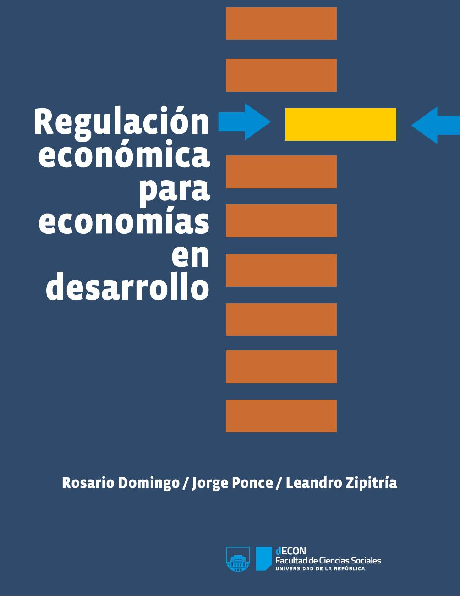

--- 
title: "Regulación económica para economías en desarrollo"
author: "Rosario Domingo, Jorge Ponce, Leandro Zipitría"
date: 'Esta version: `r Sys.Date()`'
output:
  pdf_document:
    citation_package: natbib
    latex_engine: xelatex
    keep_tex: yes
header-includes:
  - \usepackage{booktabs}
  - \usepackage{lmodern}
  - \usepackage{hyperref}
  - \usepackage{setspace}\onehalfspacing
  - \usepackage{titling}
  # - \pretitle{\begin{center} # foto de la tapa
  #   \begin{figure}[!h]
  #   \includegraphics[width=6.64in,height=9.36in]{imagenes/cover.jpg} 
  #   \end{figure}
  #   \pagebreak}
  - \posttitle{\end{center}}
  - \usepackage[nottoc]{tocbibind} # pone la bibliografía en el toc
  # html_document:
  #    df_print: paged
documentclass: book
lang: es
fontsize: 12pt
bibliography: regulacion.bib
biblio-style: econometrica-es.bst
link-citations: true
description: Este es el documento del libro "Regulación económica para economías en desarrollo" de Domingo, Ponce y Zipitría.
site: bookdown::bookdown_site
---

<!-- ```{r fig.align='center', echo=FALSE, out.width='120%',fig.pos='h'} -->
<!--  -->
<!-- ``` -->

\newpage

# Prefacio {-}

“Regulación Económica para Economías en Desarrollo” por Rosario Domingo, Jorge Ponce y Leandro Zipitría se distribuye bajo una Licencia Creative Commons Atribución 4.0 Internacional [Creative Commons Attribution-NonCommercial-ShareAlike 4.0 International License](http://creativecommons.org/licenses/by-nc-sa/4.0/).

\

**Atribución** - Cite el trabajo de la siguiente forma: Domingo, Rosario, Jorge Ponce y Leandro Zipitría (2016). Regulación económica para economías en desarrollo. Departamento de Economía - FCS, Universidad de la República, Montevideo.

\

ISBN: 978-9974-0-1325-4

\

Edición y corrección: Rosario Domingo.

Diseño de tapa: Rodolfo Fuentes / NAO

\
Los puntos de vista y las opiniones expresadas en esta publicación, son responsabilidad de los autores y no necesariamente reflejan una posición del Departamento de Economía de la Facultad de Ciencias Sociales de la Universidad de la República.

\newpage